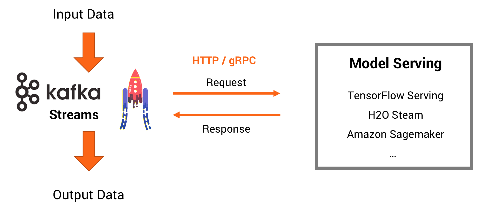

# TensorFlow Serving + gRPC + Java + Kafka Streams
This project contains a demo to do **model inference with Apache Kafka, Kafka Streams and a TensorFlow model deployed using [TensorFlow Serving](https://www.tensorflow.org/serving/)**. The concepts are very similar for other ML frameworks and Cloud Providers, e.g. you could also use [Google Cloud ML Engine](https://cloud.google.com/ml-engine/docs/tensorflow/deploying-models) for TensorFlow (which uses TensorFlow Serving under the hood) or Apache MXNet and [AWS model server](https://github.com/awslabs/mxnet-model-server). 

Most ML servers for model serving are also extendible to serve other types of models and data, e.g. you could also deploy non-TensorFlow models to TensorFlow Serving. Many ML servers are available as cloud service and for local deployment.

## Model Serving: Stream Processing vs. Request Response
Some background on model serving alternatives:

Machine Learning / Deep Learning models can be used in different ways to do predictions. The preferred way is to deploy an analytic model directly into a stream processing application (like [Kafka Streams](https://kafka.apache.org/documentation/streams/)). You could e.g. use the [TensorFlow for Java API](https://www.tensorflow.org/install/install_java). This allows best latency and independence of external services. Examples here: [Model Inference within Kafka Streams Microservices using TensorFlow, H2O.ai, Deeplearning4j](https://github.com/kaiwaehner/kafka-streams-machine-learning-examples). 

However, direct deployment of models is not always a feasible approach. Sometimes it makes sense or is needed to deploy a model in another serving infrastructure like TensorFlow Serving for TensorFlow models. Model Inference is then done via RPC / Request Response communication. Organisational or technical reasons might force this approach. Or you might want to leverage the built-in features for managing and versioning different models in the model server. This Github project shows an **example for how to access a model serving infrastructure from a stream processing microservice leveraging Apache Kafka and Kafka Streams**.

**Pros of an external model serving infrastructure like TensorFlow Serving:**
- Simple integration with existing technologies and organizational processes
- Easier to understand if you come from non-streaming world
- Later migration to real streaming is also possible
- Model management built-in for deployment of different models including versioning, A/B testing, etc.

**Cons:**
- Often tied to specific ML technologies
- Worse latency as remote call instead of local inference
- More complex security setups (remote communication through firewalls)
- No offline inference (devices, edge processing, etc.)
- Coupling the availability, scalability, and latency / throughput of your stream processing application with the SLAs of the RPC interface
- Side-effects (e.g. in case of failure) not covered by Kafka processing (e.g. Exactly Once).

### TensorFlow Serving
Let’s discuss TensorFlow Serving quickly. It can be used to host your trained analytic models. Like with most model servers, you can do inference via request-response paradigm. gRPC and REST / HTTP are the two common technologies and concepts used.

The blog post "[How to deploy TensorFlow models to production using TF Serving](https://medium.freecodecamp.org/how-to-deploy-tensorflow-models-to-production-using-tf-serving-4b4b78d41700)" is a great explanation of how to export and deploy trained TensorFlow models to a TensorFlow Serving infrastructure. You can either deploy your own infrastructure anywhere or leverage a cloud service like Google Cloud ML Engine. A [SavedModel](https://www.tensorflow.org/programmers_guide/saved_model#build_and_load_a_savedmodel) is TensorFlow's recommended format for saving models, and it is the required format for deploying trained TensorFlow models using TensorFlow Serving or deploying on Goodle Cloud ML Engine.

The core architecture is described in detail in [TensorFlow Serving's architecture overview](https://www.tensorflow.org/serving/architecture_overview):

This architecture allows deployement and managend of different models and versions of these models including additional features like A/B testing. In the following demo, we just deploy one single TensorFlow model for Image Recognition (based on the famous Inception neural network).

## Demo: Mixing Stream Processing with RPC: TensorFlow Serving + Kafka Streams

### Requirements
- Install Java 8
- Install Docker
- Kafka Streams API 2.0 (configured in pom.xml and downloaded via Maven bulid; Kafka Streams API 1.1 is also compatible)

The code is developed and tested on Mac and Linux operating systems. As Kafka does not support and work well on Windows, this is not tested at all.

### Things to do
1. Install and start a ML Serving Engine
2. Deploy prebuilt TensorFlow Model
3. Create Kafka Cluster
4. Implement Kafka Streams application
5. Deploy Kafka Streams application (e.g. locally on laptop or to a Kubernetes cluster)
6. Generate streaming data to test the combination of Kafka Streams and TensorFlow Serving

### Step 1: Create a TensorFlow model and export it to 'SavedModel' format
I simply added an existing pretrained Image Recognition model built with TensorFlow. You just need to export a model using TensorFlow's API and then use the exported folder. TensorFlow uses Protobuf to store the model graph and adds variables for the weights of the neural network.

Google ML Engine shows how to create a simple TensorFlow model for predictions of census using the "[ML Engine getting started guide](https://cloud.google.com/ml-engine/docs/tensorflow/getting-started-training-prediction)". In a second step, you can build a more advanced example for image recognition using Transfer Learning folling the guide "[Image Classification using Flowers dataset](https://cloud.google.com/ml-engine/docs/tensorflow/flowers-tutorial)".

You can also combine cloud and local services, e.g. build the analytic model with Google ML Engine and then deploy it locally using TensorFlow Serving as we do. 

### Step 2: Install and start TensorFlow Serving server + deploy model
Different options are available. Installing TensforFlow Serving on a Mac is still a pain in mid of 2018. apt-get works much easier on Linux operating systems. Unforunately there is nothing like a 'brew' command or simple zip file you can use on Mac. Alternatives:

- You can **build the project and compile everything using [Bazel build system]**(https://bazel.build/) - which literaly takes forever (on my laptop), i.e. many hours. 

- **Install and run TensorFlow Serving via a [Docker container](https://www.tensorflow.org/serving/docker)**
                
                docker build --pull -t tensorflow-serving-devel -f Dockerfile.devel .
                
                docker run -it tensorflow-serving-devel
                
                git clone --recurse-submodules https://github.com/tensorflow/serving
                cd serving/tensorflow
                ./configure
                cd ..
                bazel test tensorflow_serving/...
Also requires building the project. In addition, documentation is not very good and outdated. 
                
- **Preferred option for beginners => Use a prebuilt Docker container with TensorFlow Serving**. I used an [example from Thamme Gowda](https://github.com/thammegowda/tensorflow-grpc-java). Kudos to him for building a project which not just contains the TensorFlow Serving Docker image, but also shows an example of how to do gRPC communication between a Java application and TensorFlow Serving. 

**Pull and start container with TensorFlow Serving preinstalled (forward port 9000)**
 
            docker run -it -p 9000:9000 tgowda/inception_serving_tika

**Inside the container, start the Tensorflow Serving server - this deploys the TensorFlow model for Image Recognition**
            
            root@8311ea4e8074:/# /serving/server.sh
 
If you want to your own model, read the guide "[Deploy TensorFlow model to TensorFlow serving](https://www.tensorflow.org/programmers_guide/saved_model#load_and_serve_a_savedmodel_in_tensorflow_serving)". Or to use a cloud service, e.g. take a look at "[Getting Started with Google ML Engine](https://cloud.google.com/ml-engine/docs/tensorflow/deploying-models)".

### Step 3: Create Kafka Cluster and Kafka topics
Create a local Kafka environment (Apache Kafka broker + Zookeeper). The easiest way is the open source [Confluent CLI](https://github.com/confluentinc/confluent-cli) - which is also part of Confluent Open Source and Confluent Enteprise Platform:

                confluent start kafka
                
You can also create a cluster using Kafka as a Service. Best option is [Confluent Cloud - Apache Kafka as a Service](https://www.confluent.io/confluent-cloud/). You can choose between Confluent Cloud Professional for "playing around" or Confluent Cloud Enterprise on AWS, GCP or Azure for mission-critical deployments including 99.95% SLA and very large scale up to 2 GBbyte/second throughput. The third option is to connect to your existing Kafka cluster on premise or in cloud (note that you need to change the broker URL and port in the Kafka Streams Java code before building the project).

Next create the two Kafka topics for this example ('ImageInputTopic' for URLs to the image and 'ImageOutputTopic' for the prediction result):
                
                kafka-topics --zookeeper localhost:2181 --create --topic ImageInputTopic --partitions 3 --replication-factor 1
                
                kafka-topics --zookeeper localhost:2181 --create --topic ImageOutputTopic --partitions 3 --replication-factor 1

### Step 4 Build and deploy Kafka Streams app + send test messages
The Kafka Streams microservice [Kafka_Streams_TensorFlow_Serving_gRPC_Example](https://github.com/kaiwaehner/tensorflow-serving-java-grpc-kafka-streams/blob/master/src/main/java/com/github/megachucky/kafka/streams/machinelearning/Kafka_Streams_TensorFlow_Serving_gRPC_Example.java) is the Kafka Streams Java client. The microservice uses gRPC and Protobuf for request-response communication with the TensorFlow Serving server to do model inference to predict the contant of the image. Note that the Java client does not need any TensorFlow APIs, but just gRPC interfaces.

Let's build the project:

                mvn clean package 
                
This example executes a Java main method, i.e. it starts a local Java process running the Kafka Streams microservice. It waits continuously for new events arriving at 'ImageInputTopic' to do a model inference (via gRCP call to TensorFlow Serving) and then sending the prediction to 'ImageOutputTopic' - all in real time within milliseconds.

                java -cp target/tensorflow-serving-java-grpc-kafka-streams-1.0-jar-with-dependencies.jar com.github.megachucky.kafka.streams.machinelearning.Kafka_Streams_TensorFlow_Serving_gRPC_Example

In the same way, you could deploy this Kafka Streams microservice anywhere - including Kubernetes (e.g. on premise OpenShift cluster or Google Kubernetes Engine), Mesosphere, Amazon ECS or even in a Java EE app - and scale it up and down dynamically.
                
Now send messages, e.g. with kafkacat...

                echo -e "src/main/resources/example.jpg" | kafkacat -b localhost:9092 -P -t ImageInputTopic
                
... and consume predictions:

                kafka-console-consumer --bootstrap-server localhost:9092 --topic ImageOutputTopic --from-beginning
                
To stop everything, stop the Docker container with TensorFlow Serving, stop the Kafka Consumer, and finally stop Kafka using using Confluent CLI (which also deletes all configuration and topics):

                confluent destroy
